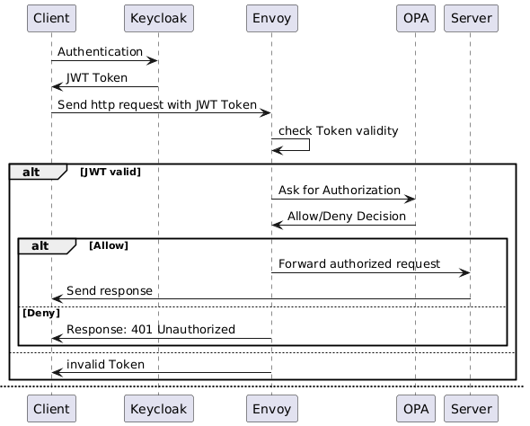

# Security for the Eclipse BaSyx Python SDK - HTTP Server

This branch adds access control features to the BaSyx server using Open Policy Agent (OPA), Envoy Proxy and Keycloak. The setup ensures that all incoming requests are authenticated through Keycloak and authorized based on policies defined in OPA.


## Overview
This setup uses:
1. **Keycloak** for user authentication.
2. **Open Policy Agent (OPA)** for access control.
3. **Envoy Proxy** to act as an intermediary, enforcing authentication and authorization.

## Why Use Envoy?
Envoy is especially suitable when you want to implement security without modifying your existing application. It acts as a sidecar proxy that can handle authentication, authorization and other features.

## Workflow


## How to use?
Clone this repository. Ensure you are in the root directory of the cloned repository, then run:
```
docker-compose up --build -d
```

Furthermore, you need to add client authentication with Keycloak in your client code. If you are using our our [aas-python-http-client](https://github.com/rwth-iat/aas-python-http-client) , just add these lines to your main.py file:


```
import requests

# Step 1: Get an access token from Keycloak
keycloak_url = "http://localhost:8080/realms/myBasyxServer/protocol/openid-connect/token"
client_id = "myBasyxClient"
client_secret = "0MSF64IzBhJ7Rn0pjOdafqVIB8udEQWq"
username = "aa"
password = "aa"

<<<<<<< HEAD
token_response = requests.post(keycloak_url, data={
'grant_type': 'password',
'client_id': client_id,
'client_secret': client_secret,
'username': username,
'password': password
})

if token_response.status_code != 200:
raise Exception(f"Failed to obtain token: {token_response.text}")

access_token = token_response.json().get('access_token')

api_client.default_headers['Authorization'] = f'Bearer {access_token}'
```
